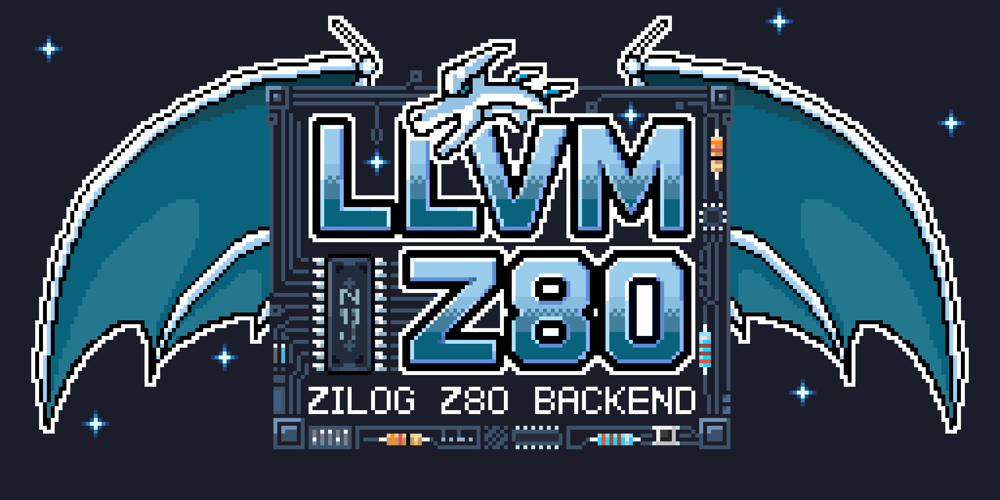

<p align="center">
  <picture>
    <source media="(prefers-color-scheme: light)" srcset="artwork/LLVM-Z80-light@10x.png">
    
  </picture>
  <br/>
  <sub>Artwork by zlfn, based on the LLVM logo. Lettering assisted by AI & fonts.<br/>
       Created with <a href="https://www.aseprite.org/">Aseprite</a> / <a href="artwork">Source files</a></sub>
</p>

<!-- prettier-ignore -->
LLVM-Z80 is an LLVM fork supporting the Zilog Z80 series of microprocessors.  
[[Releases]](https://github.com/llvm-z80/llvm-z80/releases) |
[[Nightly]](https://github.com/llvm-z80/llvm-z80/releases/tag/nightly) |
[[Backend Code]](https://github.com/llvm-z80/llvm-z80/tree/main/llvm/lib/Target/Z80) |
[[Tests / Utilities]](https://github.com/llvm-z80/llvm-z80/tree/main/z80-utils) |
[[Wiki]](https://github.com/llvm-z80/llvm-z80/wiki) |
[[FAQ]](https://github.com/llvm-z80/llvm-z80/wiki/FAQ) |
[[AUTHORS]](https://github.com/llvm-z80/llvm-z80/blob/main/AUTHORS) |
[[NOTICE]](https://github.com/llvm-z80/llvm-z80/blob/main/NOTICE)

## Notice

The llvm-z80 project is an independent, community-driven effort. It is not
officially affiliated with, sponsored by, or endorsed by the LLVM Foundation or
LLVM project. Our project is a fork of LLVM that provides a new backend/target;
our project is based on LLVM, not a part of LLVM. LLVM is a trademark of the
LLVM Foundation, and our use of LLVM or other related trademarks does not imply
affiliation or endorsement.

Zilog, Z80, Z180 and eZ80 are trademarks of Zilog, Inc. The llvm-z80 project is
not affiliated with, sponsored by, or endorsed by Zilog. Other product names in
this document belong to their respective owners. These names are used only to
identify the processors and hardware that LLVM-Z80 targets.

## Target

**Zilog Z80**, **Sharp SM83** <sup><a href="#sm83-support">†1</a></sup>

If you would like support for a specific target, feel free to comment
[here](https://github.com/llvm-z80/llvm-z80/issues/90).

## Features

- Integer arithmetic for types **up to 128 bits wide.**
  <sup><a href="#integer-arithmetic">†2</a></sup>
- Half- and single-precision floating-point arithmetic **following the IEEE 754
  standard.**
  <sup><a href="#float-arithmetic">†3</a></sup><sup><a href="#fast-math">†4</a></sup>
- Calling conventions compatible with SDCC / Z88DK
- Dual toolchain support:
  - **ELF path** (default): integrated assembler + `ld.lld` linker
    (`--target=z80`)
  - **SDCC path**: sdasz80 assembler + sdldz80 linker
    (`--target=z80-unknown-none-sdcc`)
- LLVM tools with Z80 support:
  - `llvm-mc`: assembler and disassembler
  - `ld.lld`: linker
  - `llvm-objdump`: disassembles object files and executables
  - `llvm-objcopy`: converts ELF files to raw binary or Intel HEX
  - `llvm-readobj`: prints ELF headers, sections, and symbols
  - `llvm-nm`: lists symbols
  - `llvm-ar`: creates static libraries
  - `llvm-strip`: removes symbols and debug information
- Cross-linking with SDCC-compiled code via
  [elf2rel / rel2elf](https://github.com/llvm-z80/llvm-z80/tree/main/z80-utils)
  converters
- LLVM's world-class global optimizations
- Clang's expressive error and warning messages

## Frontend Integration

- **C/C++**: Supported via Clang included in this repository (C++ is
  experimental and untested)
- **Rust**: [llvm-z80/rust-z80](https://github.com/llvm-z80/rust-z80)
- **Zig**: [llvm-z80/zig-z80](https://github.com/llvm-z80/zig-z80)
- **Others**: Potential support for other LLVM-based languages (TinyGo, Embedded
  Swift)

We always welcome new frontend support!

# Building LLVM-Z80

## Prerequisites

- CMake 3.20+
- Ninja (recommended)
- SDCC toolchain (`sdasz80`, `sdldz80`): required for the SDCC toolchain path
  and cross-build testing

## Clone the LLVM-Z80 repository

On Linux and macOS:

```bash
git clone https://github.com/llvm-z80/llvm-z80.git
```

On Windows:

```bash
git clone --config core.autocrlf=false https://github.com/llvm-z80/llvm-z80.git
```

If you fail to use the --config flag as above, then verification tests will fail
on Windows.

## Build the LLVM-Z80 project

```bash
cmake -C clang/cmake/caches/Z80.cmake -G Ninja -S llvm -B build
ninja -C build # Build llc + clang + lld + Z80Runtime
```

## Usage

### ELF Toolchain (default)

Uses the integrated assembler and `ld.lld` linker. Produces ELF binaries.

```bash
# Compile C to ELF
clang --target=z80 -O1 input.c -o output.elf

# Convert to flat binary and execute
llvm-objcopy -O binary output.elf output.bin
z88dk-ticks -trace -end $(llvm-nm output.elf | awk '/ _halt$/ {print $1}') output.bin
```

### SDCC Toolchain

Uses the sdasz80 assembler and the sdldz80 linker. Produces Intel HEX (.ihx)
files. Useful for cross-linking with SDCC-compiled code.

For more information on SDCC integration, refer to the
[LLVM-Z80 wiki](https://github.com/llvm-z80/llvm-z80/wiki/SDCC-Interoperability).

```bash
# Compile C to Intel HEX (via sdasz80 + sdldz80)
clang --target=z80-unknown-none-sdcc -O1 input.c -o output.ihx

# Compile to .rel object file only (for linking with SDCC code)
clang --target=z80-unknown-none-sdcc -c -O1 input.c -o input.rel
```

### SM83 (Game Boy)

```bash
# ELF path
clang --target=sm83 -O1 input.c -o output.elf
llvm-objcopy -O binary output.elf output.bin
z88dk-ticks -mgbz80 -trace -end $(llvm-nm output.elf | awk '/ _halt$/ {print $1}') output.bin

# SDCC path
clang --target=sm83-nintendo-none-sdcc -O1 input.c -o output.ihx
```

### Step-by-step compilation

```bash
# LLVM IR → assembly → object → link (ELF path)
clang --target=z80 -O1 -S -emit-llvm input.c -o input.ll
llc -mtriple=z80 -O1 input.ll -o input.s
clang --target=z80 input.s -o output.elf

# LLVM IR → assembly → object → link (SDCC path)
clang --target=z80 -O1 -S -emit-llvm input.c -o input.ll
llc -mtriple=z80 -O1 -z80-asm-format=sdasz80 input.ll -o input.s
sdasz80 -g -o input.rel input.s
sdldz80 -i output.ihx input.rel build/lib/z80/z80_rt.lib
```

Runtime libraries are built at `build/lib/z80/` and `build/lib/sm83/`.

## Releases

Releases are cut from a release branch. Each release branch follows one upstream
LLVM release line. For example, the `release/22.x` branch tracks LLVM 22.
Releases are annotated tags named `llvmz80-<upstream version>-r<n>`. The first
part is the upstream LLVM release the branch sits on, and `-r<n>` is the
downstream revision on top of it.

Prebuilt binaries on the
[releases page](https://github.com/llvm-z80/llvm-z80/releases) are built from
these tags.

## Contributing

### Branches

Development happens on `main`. Please open pull requests against `main`. Do not
push to or open pull requests against a release branch. Maintainers cherry-pick
merged fixes onto the release branch.

### AI-assisted contributions

LLVM-Z80 permits the use of AI automation tools, including automatically
generated issues and pull requests.

Be aware of two things. Automated submissions may be handled at a lower priority
than ones written by a person. And a pull request that shows no sign of having
been reviewed by a human may be closed without further review. If you submit it,
you are responsible for it, so read the diff, build it, and be ready to explain
why it is correct.

## Related Works

LLVM-Z80 stands on the shoulders of the following projects.

- [LLVM](https://llvm.org/): The LLVM Compiler Infrastructure, upstream of this
  project.
- [LLVM-MOS](https://llvm-mos.org/): Another LLVM backend for a classic CPU.
  LLVM-Z80 has adopted many optimization passes from LLVM-MOS.
- [(e)Z80-clang](https://github.com/CE-Programming/llvm-project): The most
  mature LLVM backend for the eZ80 (ADL mode).
- [ajokela/LLVM-Z80](https://github.com/ajokela/llvm-z80): An experimental
  GlobalISel-based Z80 backend. LLVM-Z80 was developed from this fork.
- [gb-llvm](https://github.com/DaveDuck321/gb-llvm): An experimental LLVM
  backend for the Nintendo Game Boy (SM83), including actual game ROM examples.
- [Rust-GB](https://github.com/zlfn/rust-gb): Compiling Rust for the Game Boy.
  The reason this project was born.

**Many Other Experimental LLVM-Z80 Backends**

- [gt-retro-computing](https://github.com/gt-retro-computing/llvm-z80),
  [euclio](https://github.com/euclio/llvm-gbz80),
  [Bevinsky](https://github.com/Bevinsky/llvm-gbz80)

### Footnotes

- <sup><a id="sm83-support" href="#sm83-support">†1</a></sup>SM83 support is
  limited to the Game Boy's Sharp LR35902 CPU. Other SM83xx variants, such as
  SM8311 and SM8313, have not been tested.
- <sup><a id="integer-arithmetic" href="#integer-arithmetic">†2</a></sup>Primary
  support for i8, i16, i32, and i64; experimental support for i128.
- <sup><a id="float-arithmetic" href="#float-arithmetic">†3</a></sup>Primary
  support for f32, experimental support for f16, and planned support for f64.
- <sup><a id="fast-math" href="#fast-math">†4</a></sup>The `-ffast-math` flag
  allows you to disable strict IEEE 754 compliance. While this improves code
  efficiency, it may cause floating-point operations to behave unexpectedly in
  certain edge cases.
